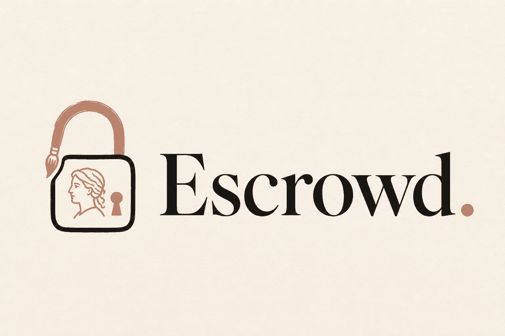

# Escrowd

<p align="center">
  
</p>

Escrow for illustration commissions. Nour puts one link in her Instagram bio. A client fills a brief, pays a deposit, and gets a page they can return to. Nour gets a dashboard. Payment is the gate at both ends — no deposit, no work; no final payment, no file.

**One mechanism, five problems — not five features.** Spec: [`docs/plan.md`](docs/plan.md). Problem analysis: [`docs/problem-analysis-bilingual.pdf`](docs/problem-analysis-bilingual.pdf).

This repo is Next.js + Supabase + Paymob. Reuse [`src/lib/paymob.ts`](src/lib/paymob.ts). Do not rewrite HMAC from memory. Do not build Scope Guard, AI pricing, or change-order payments.

---

## What we are building today

- Arabic-first RTL brief with a live price calculator (commercial usage ×3 — say it in the demo)
- Order created as `awaiting_deposit` **before** checkout, secret URL `/o/[token]`
- Paymob Unified Checkout twice: **deposit** starts work, **balance** unlocks the file
- HMAC-verified webhook is the only source of truth for paid
- Nour dashboard: advance one stage, upload preview + final
- `final_url` is returned only after `balance_paid_at`

**Out:** chat, client accounts, fake card UI, AI pricing, Scope Guard, lead score, subscriptions.

Kill switches: **2:30** no verified checkout → drop everything until one test-card payment flips a row. **4:00** no balance path → single payment of `price_total`, still webhook-only.

---

## Spec and agent files

| File | Role |
| --- | --- |
| [`docs/plan.md`](docs/plan.md) | Canonical product, schema, Paymob contract, streams |
| [`docs/Architecture.md`](docs/Architecture.md) | System shape, trust boundaries, status machine, code map |
| [`docs/changelog.md`](docs/changelog.md) | What landed vs what is still the demo starter |
| [`AGENTS.md`](AGENTS.md) | Canonical agent instructions (keep the Next.js block at the top) |
| [`CLAUDE.md`](CLAUDE.md) | Claude Code — points at AGENTS.md; always update docs |
| [`cursor.md`](cursor.md) | Cursor — points at AGENTS.md and `.cursor/rules` |
| [`grok.md`](grok.md) | Grok — same lock as Cursor/Claude |
| [`.cursor/rules/`](.cursor/rules/) | Always-on Cursor rules (product, schema, Paymob, pricing, docs-sync) |
| [`.agents/skills/paymob-integration/`](.agents/skills/paymob-integration/) | Official Paymob AI skill (HMAC, Intention, test cards) |
| [`.cursor/mcp.json`](.cursor/mcp.json) / [`.mcp.json`](.mcp.json) | Paymob MCP (`https://mcp.paymob.com/mcp`) — live account ops only; not the paid signal |
| [`.cursor/commands/`](.cursor/commands/) | `/paymob-test-cards`, `/paymob-explain-error`, `/paymob-check-hmac` |
| [`docs/problem_to_solve_and_build.md`](docs/problem_to_solve_and_build.md) | Origin note — do not implement against it |

---

## Quick start

```bash
npm install
cp .env.example .env.local   # fill it in — table below
npm run dev
```

1. Create a Supabase project → https://supabase.com/dashboard
2. Apply [`supabase/migrations/0002_escrowd_orders.sql`](supabase/migrations/0002_escrowd_orders.sql) on a fresh project. The hosted project needed [`0003_escrowd_orders_replace.sql`](supabase/migrations/0003_escrowd_orders_replace.sql) (already applied) because leftover Scope Guard columns were still on `orders`.
3. Fill `.env.local` (copy from `.env.example`). Project URL and publishable key can live there; **service role and Paymob keys stay server-only and must not be committed**.
4. Deploy or ngrok so Paymob can hit `/api/paymob/webhook`
5. Open `/ar/commission` → deposit checkout → webhook sets `deposit_paid_at`

`/` redirects to `/ar`. Arabic is the default locale. Nour signs in at `/ar/sign-in` for `/dashboard`. Public `/sign-up` is closed. Clients have no account — they use `/o/[token]`. Header toggle switches light/dark (saved in `localStorage`).

---

## Environment variables

| Variable | Where to get it |
| --- | --- |
| `NEXT_PUBLIC_SITE_URL` | Production: `https://cursor-paymob-buildathon-five.vercel.app` (no trailing slash). Local UI can stay this so Paymob callbacks hit Vercel, not localhost |
| `NEXT_PUBLIC_SUPABASE_URL` | Supabase → Project Settings → API → Project URL |
| `NEXT_PUBLIC_SUPABASE_PUBLISHABLE_KEY` | API Keys → Publishable key (`sb_publishable_…`). Safe in the browser if RLS is on. Older name: `NEXT_PUBLIC_SUPABASE_ANON_KEY` |
| `SUPABASE_SECRET_KEY` | API Keys → Secret keys (`sb_secret_…`). **Server only.** Bypasses RLS. Legacy alias: `SUPABASE_SERVICE_ROLE_KEY` |
| `PAYMOB_SECRET_KEY` | Paymob → Settings → Account Info → API Keys → Secret Key (`egy_sk_test_…`). **Server only** |
| `PAYMOB_PUBLIC_KEY` | Same screen → Public Key (`egy_pk_test_…`). Safe in the checkout URL |
| `PAYMOB_INTEGRATION_IDS` | Settings → Payment Integrations. Comma-separated integers that belong to **this** Secret Key (test card on this merchant: `5853667`). Add wallet only if that method exists in Test mode |
| `PAYMOB_HMAC_SECRET` | Settings → Account Info → HMAC |
| `PAYMOB_API_KEY` | Same API Keys screen. Transaction Inquiry fallback only |

Test/Live of Secret Key, HMAC, and Integration IDs must match or Intention returns 404.

### Paymob MCP (optional)

Cursor/Claude can talk to Paymob’s hosted MCP at `https://mcp.paymob.com/mcp` (see [`.cursor/mcp.json`](.cursor/mcp.json)). Enable **paymob** in Cursor Settings → MCP, then in chat the agent calls `set_api_credentials` with **test** API key + secret key. Never put keys in those JSON files.

MCP is for listing transactions and creating test intentions. **HMAC webhook is still the only paid signal** — do not mark an Escrowd order paid from MCP output.

### Test cards (sandbox keys only)

Event-provided cards win if they differ.

- Mastercard: `5123456789012346`, exp `01/39`, CVV `123`, name `Test Account`
- Visa: `4987654321098769`, exp `12/25`, CVV `123`

Pay a **deposit** and a **balance** on the deployed URL before the demo slot.

---

## Payment flow (deposit then balance)

```
Client                         Server                         Paymob
  |                              |                               |
  |-- POST /api/orders --------->|  insert awaiting_deposit      |
  |   (server prices)            |  return { token }             |
  |-- POST /api/checkout ------->|                               |
  |   { token, kind }            |-- POST /v1/intention/ ------->|
  |                              |   Token SK                    |
  |                              |   special_reference =         |
  |                              |   {token}:{kind}:{attemptId}  |
  |<-- { checkoutUrl } ----------|                               |
  |-- Unified Checkout ----------------------------------------->|
  |                              |<-- POST /api/paymob/webhook   |
  |                              |    HMAC SHA-512, then         |
  |                              |    deposit → in_progress      |
  |                              |    balance → delivered        |
  |<-- /o/[token]?checkout=returning  (poll until status moves)  |
```

**Webhook is the source of truth.** Redirect query params are not. Dashboard PATCH cannot set `*_paid_at` or jump to `in_progress` / `delivered`.

`special_reference` is `{token}:{kind}:{attemptId}` so deposit and balance cannot be confused. New Intention every pay click (`client_secret` is single-use).

Wallets: Intention `notification_url` is documented as card-only. Also register `/api/paymob/webhook` on **each** dashboard integration (card and wallet). After return, `/o/[token]` polls. If HMAC fights you, do **not** skip verify — Transaction Inquiry fallback, then the same `isPaid()` rules.

All Paymob code lives in [`src/lib/paymob.ts`](src/lib/paymob.ts). Official skill: [`.cursor/skills/paymob-integration`](.cursor/skills/paymob-integration).

App APIs:

| Method | Path | Role |
| --- | --- | --- |
| `POST` | `/api/checkout` | Create Intention, return Unified Checkout URL |
| `POST` | `/api/paymob/webhook` | HMAC-verified callback (source of truth) |
| `POST` | `/api/paymob/inquiry` | Transaction Inquiry fallback (`PAYMOB_API_KEY`) |
| `GET` | `/api/paymob/redirect/[locale]` | Browser return — UX only, never marks paid |

---

## Status machine

```
awaiting_deposit  --webhook deposit-->  in_progress
in_progress       --Nour + preview-->   ready_for_review
ready_for_review  --Nour + final----->  awaiting_balance
awaiting_balance  --webhook balance-->  delivered
```

Nour advances one legal step only. `GET /api/orders/:token` strips `final_url` until `balance_paid_at`.

---

## Pricing

Same function on the client (live UI) and the server (Intention amount). Browser never chooses what Paymob charges.

| Input | Effect |
| --- | --- |
| Type: portrait / character / logo-mascot / menu-set | base 800 / 1200 / 3000 / 2500 EGP |
| Extra subject | +60% of base each |
| Detail: sketch / flat colour / full render | ×0.5 / ×1.0 / ×1.6 |
| Background: none / simple / full scene | +0 / +300 / +900 |
| Usage: personal / commercial | ×1.0 / ×3.0 |

Store integer **piastres**. `deposit = round(total / 2)`, `balance = total - deposit`.

---

## Streams

Teams are formed at the event. Hand whoever you get:

1. **Paymob** — Intention, webhook, two `kind`s, Vercel URL in the Paymob dashboard
2. **Client** — brief + `/o/[token]`
3. **Dashboard** — Nour list, advance, uploads
4. **Glue** (if four people) — schema, Arabic copy, seed, 90-second script, E2E on Vercel

Acceptance criteria are in `docs/plan.md`.

---

## Local webhooks (ngrok)

Paymob cannot reach `localhost`.

```bash
ngrok http 3000
```

Set `NEXT_PUBLIC_SITE_URL` to the HTTPS origin, restart `npm run dev`. Also paste that URL as the Transaction processed callback on card **and** wallet integrations.

HMAC mismatch almost always means `PAYMOB_HMAC_SECRET` is from a different account. Tester: https://wizard.paymob.com/

---

## Deploy to Vercel

```bash
npx vercel
npx vercel --prod
```

Add every env var for Production (Vercel → Project → Settings → Environment Variables). `.env.local` is gitignored and **does not deploy**. Missing `NEXT_PUBLIC_SUPABASE_URL` and `NEXT_PUBLIC_SUPABASE_PUBLISHABLE_KEY` used to 500 every page (proxy + header). The site now renders without them; auth and checkout still need those keys plus `SUPABASE_SECRET_KEY` on Vercel.

`NEXT_PUBLIC_SITE_URL` = `https://cursor-paymob-buildathon-five.vercel.app` (no trailing slash). Redeploy after adding vars. Register `https://cursor-paymob-buildathon-five.vercel.app/api/paymob/webhook` in Paymob (card **and** wallet).

Do not add `@next/swc-darwin-*` (or any platform SWC package) to `dependencies`. Next already pulls the right optional binary; a Darwin-only required dep makes Linux Vercel builds fail with `EBADPLATFORM`.

Hour 0 of the build: this URL must exist.

---

## Layout

```
public/brand/                     Logo mark and lockup (transparent PNG; *-on-paper for cream-backed)
src/lib/paymob.ts                 HMAC, Intention, billing_data "NA", Inquiry
src/lib/apply-paymob-transaction.ts  deposit/balance persist after HMAC or Inquiry
src/lib/pricing.ts                live UI + server amount
src/app/api/paymob/webhook        HMAC, then deposit or balance
src/app/api/paymob/inquiry        Transaction Inquiry fallback
src/app/api/checkout              { token, kind }, server price, no login
src/app/[locale]/commission       public brief
src/app/[locale]/o/[token]        client order page
src/app/[locale]/dashboard        Nour only
```

RTL is already real: `<html dir>` from locale, Tailwind logical utilities (`ms-*`, `ps-*`, `text-start`). Do not fake RTL with a `lang` attribute.

---

## Tests

```bash
npm test
```

HMAC field order, tampered-amount reject, `billing_data` → `"NA"`, piastres conversion, `isPaid`, `parseSpecialReference`, pricing ×3 commercial. Keep these green when you change checkout/webhook.

---

## Demo script (90 seconds, deployed URL)

Two windows: client left, Nour right.

1. Portrait, 2 subjects, full render, **commercial** — price jumps ×3
2. Deposit on real Unified Checkout (wallets come free with it)
3. Nour advances, uploads preview
4. Client pays balance
5. File unlocks
