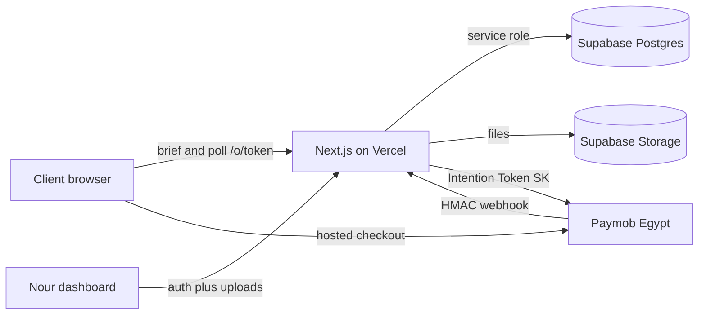
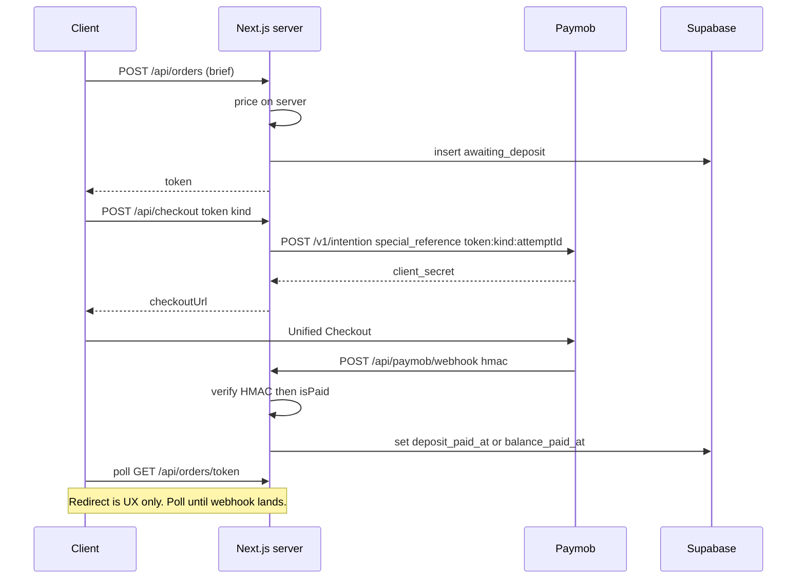
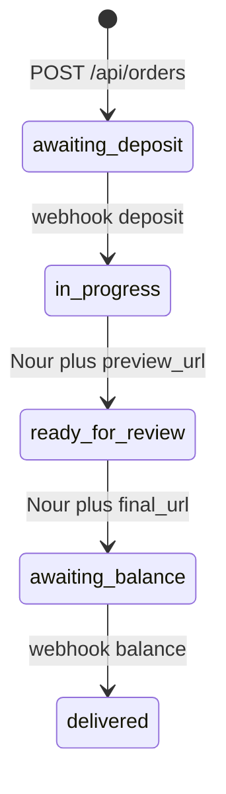

# Escrowd architecture

Escrow for illustration commissions. Deposit starts work; balance unlocks the file. Product spec and build order: [`plan.md`](plan.md). Changelog: [`changelog.md`](changelog.md).

Agent files (keep in lockstep; always update docs in the same turn as code): [`../AGENTS.md`](../AGENTS.md), [`../CLAUDE.md`](../CLAUDE.md), [`../cursor.md`](../cursor.md), [`../grok.md`](../grok.md). Cursor rules include `docs-sync.mdc`.

This file is the system shape: trust boundaries, data, payments, and how the pieces talk. It describes the **target** Escrowd architecture. The repo still contains a Paymob **demo starter** (signed-in 100 EGP checkout, `pending | paid | failed`). Replace that schema and the `/demo` path; do not rewrite [`src/lib/paymob.ts`](../src/lib/paymob.ts).

---

## Context

Two human surfaces, one money rail:

| Who | Surface | Auth |
| --- | --- | --- |
| Client | Brief form, `/o/[token]` | None. Unguessable 12-char token |
| Nour | `/dashboard/*` | One admin (Supabase Auth) |
| Paymob | Hosted Unified Checkout | Paymob’s page. We never collect cards |

---

## Decisions that must not drift

1. **No client accounts.** Order page is `/o/[token]`. The starter’s “must be signed in to pay” path is leftover.
2. **Two payments, one integration.** Same `createIntention()` for `kind=deposit` and `kind=balance`. New Intention every click (`client_secret` is single-use).
3. **Webhook is the only paid signal.** Redirect query params and dashboard PATCH cannot set `*_paid_at` or jump to `in_progress` / `delivered`.
4. **Price is a server function.** The live calculator is display. Intention `amount` is recomputed from `brief`.
5. **One `orders` table.** No `clients`, `payments`, or `change_orders` tables today.
6. **Arabic-first RTL** via next-intl (`/` → `/ar`). Tailwind logical utilities, not a fake `dir` on a Latin layout.

---

## Stack (today)

| Layer | Choice | Notes |
| --- | --- | --- |
| App | Next.js 16 App Router, TypeScript | Locale prefix `[locale]` |
| UI | Tailwind 4, next-intl | Arabic default |
| Data | Supabase Postgres + Storage | Service role for writes; RLS: no browser insert/update |
| Pay | Paymob Intention + Unified Checkout | [`src/lib/paymob.ts`](../src/lib/paymob.ts) |
| Host | Vercel | Public URL required from hour 0 for webhooks |

---

## Trust and money

**Paid fields** (`deposit_paid_at`, `balance_paid_at`, status `in_progress` / `delivered`) are written only in the webhook handler (or Transaction Inquiry using the same `isPaid()` rules). HMAC mismatch → 401, no UPDATE.

**Wallets:** Intention `notification_url` is documented as card-only. Also register `/api/paymob/webhook` on each Paymob dashboard integration (card and wallet). After return, `/o/[token]` polls. Do not skip HMAC; Inquiry is the fallback.

**Correlation:** `special_reference` = `{token}:{kind}:{attemptId}` (unique per Intention). `extras: { token, kind, attemptId }`. Webhook parses `obj.order.merchant_order_id`.

**File unlock:** `GET /api/orders/:token` omits `final_url` unless `balance_paid_at` is set. Preview may show earlier. No watermark pipeline — Nour uploads two files.

---

## Status machine

| Transition | Actor | Guard |
| --- | --- | --- |
| `awaiting_deposit → in_progress` | Webhook | `kind=deposit` and `isPaid` |
| `in_progress → ready_for_review` | Nour | `preview_url` set |
| `ready_for_review → awaiting_balance` | Nour | `final_url` set (still hidden from client) |
| `awaiting_balance → delivered` | Webhook | `kind=balance` and `isPaid` |

Nour cannot skip or go backwards. Duplicate webhooks: if the matching `*_paid_at` is already set, return 200. `success=false` does not flip status.

Kill switch at 4:00: single payment of `price_total` still uses the webhook as the only paid signal.

---

## Data

Target `orders` row (piastres are integers; no floats):

- Identity: `id`, `token` (unique nanoid), `created_at`
- Client: `client_name`, `client_email`, `client_phone`
- Frozen brief: `brief` jsonb (`type`, `subjects`, `detail_level`, `background`, `usage`, `revisions`)
- Money: `price_total`, `price_deposit`, `price_balance`
- Status + paid timestamps
- Paymob ids per kind (order id + transaction id)
- `preview_url`, `final_url`

Writes go through the service-role key. Public read is by token on the server, not a wide-open select.

**Starter table (replace, do not keep both):** `user_id`, `amount`, `status pending|paid|failed`, one `paymob_order_id`. That is the demo, not Escrowd.

---

## Pricing

One function, client (live UI) and server (Intention amount):

| Input | Effect |
| --- | --- |
| Type portrait / character / logo-mascot / menu-set | base 800 / 1200 / 3000 / 2500 EGP |
| Extra subjects | +60% of base each |
| Detail sketch / flat colour / full render | ×0.5 / ×1.0 / ×1.6 |
| Background none / simple / full scene | +0 / +300 / +900 |
| Usage personal / commercial | ×1.0 / ×3.0 |

`totalPiastres = round(egp * 100)`, `deposit = round(total / 2)`, `balance = total - deposit`.

---

## HTTP surface (target)

| Method | Path | Who | Does |
| --- | --- | --- | --- |
| POST | `/api/orders` | Client | Create `awaiting_deposit`, server price, return `{ token }` |
| GET | `/api/orders/:token` | Client | Order for `/o/[token]`; strip `final_url` until balance paid |
| POST | `/api/checkout` | Client | `{ token, kind }`; return hosted checkout URL |
| POST | `/api/paymob/webhook` | Paymob | HMAC, then paid fields |
| GET | `/api/dashboard/orders` | Nour | List + status filter |
| PATCH | `/api/dashboard/orders/:id` | Nour | Advance one legal step |
| POST | `/api/dashboard/orders/:id/preview` | Nour | Set `preview_url` |
| POST | `/api/dashboard/orders/:id/final` | Nour | Set `final_url` (not exposed yet) |

**Exists now (demo):** `POST /api/checkout` (signed-in, trusts `amountEgp`), `POST /api/paymob/webhook` (sets `paid`), redirect to `/{locale}/checkout/success|failure`.

---

## Code map

| Path | Role |
| --- | --- |
| [`src/lib/paymob.ts`](../src/lib/paymob.ts) | Intention, checkout URL, HMAC, `isPaid` — **keep** |
| [`src/app/api/paymob/webhook/route.ts`](../src/app/api/paymob/webhook/route.ts) | Callback — extend for deposit vs balance |
| [`src/app/api/checkout/route.ts`](../src/app/api/checkout/route.ts) | Replace: `{ token, kind }`, no login, server price |
| [`src/lib/supabase/`](../src/lib/supabase/) | Browser, cookie, and admin clients; `env.ts` for publishable key |
| [`src/proxy.ts`](../src/proxy.ts) | Locale + session |
| [`src/app/[locale]/demo/`](../src/app/%5Blocale%5D/demo/) | Delete when Escrowd brief exists |
| [`supabase/migrations/0001_orders.sql`](../supabase/migrations/0001_orders.sql) | Replace with Escrowd columns |

Env: `NEXT_PUBLIC_SITE_URL`, `NEXT_PUBLIC_SUPABASE_URL`, `NEXT_PUBLIC_SUPABASE_PUBLISHABLE_KEY` (or legacy `ANON_KEY`), `SUPABASE_SERVICE_ROLE_KEY`, `PAYMOB_SECRET_KEY`, `PAYMOB_PUBLIC_KEY`, `PAYMOB_HMAC_SECRET`, `PAYMOB_INTEGRATION_IDS`, optional `PAYMOB_API_KEY` for Inquiry. Secret key never in the client bundle. Clients live in [`src/lib/supabase/`](../src/lib/supabase/) — session refresh is [`src/proxy.ts`](../src/proxy.ts) (Next.js 16), not a separate `middleware.ts`. Copy `.env.example` to `.env.local`; never commit real keys.

---

## Out of architecture today

Chat, client accounts, multi-artist, email, revision workflow, client uploads, websockets, AI pricing, Scope Guard, lead score, subscriptions, fake card UI. Roadmap only: paid change orders on the frozen brief.

If the event challenge is not 03: keep two-payment + webhook + secret status page; swap the form, not this payment model.
